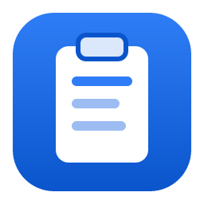
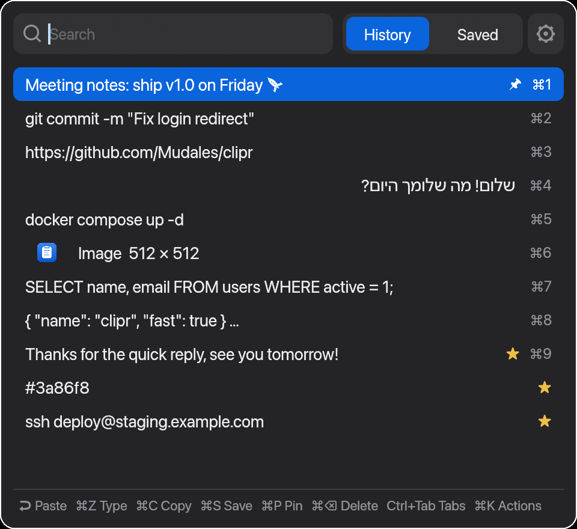
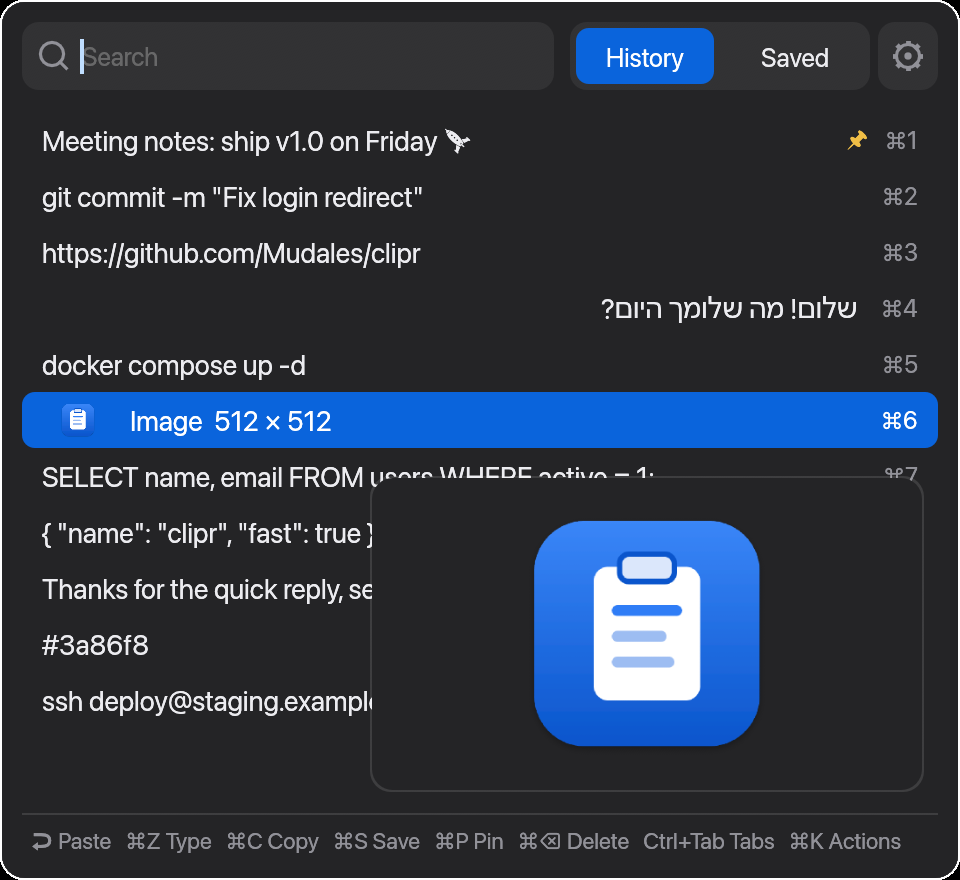
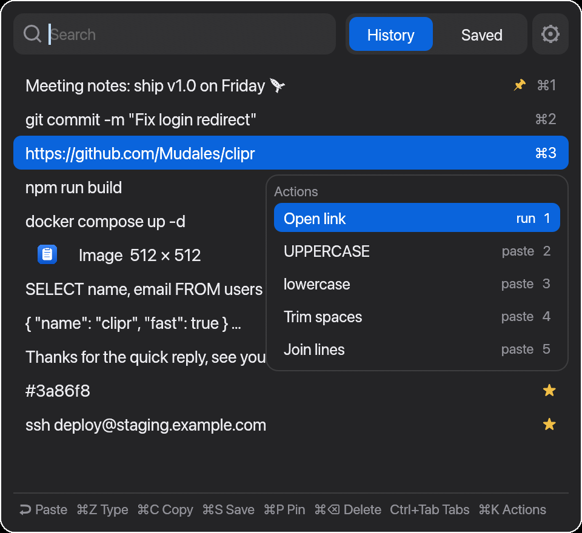
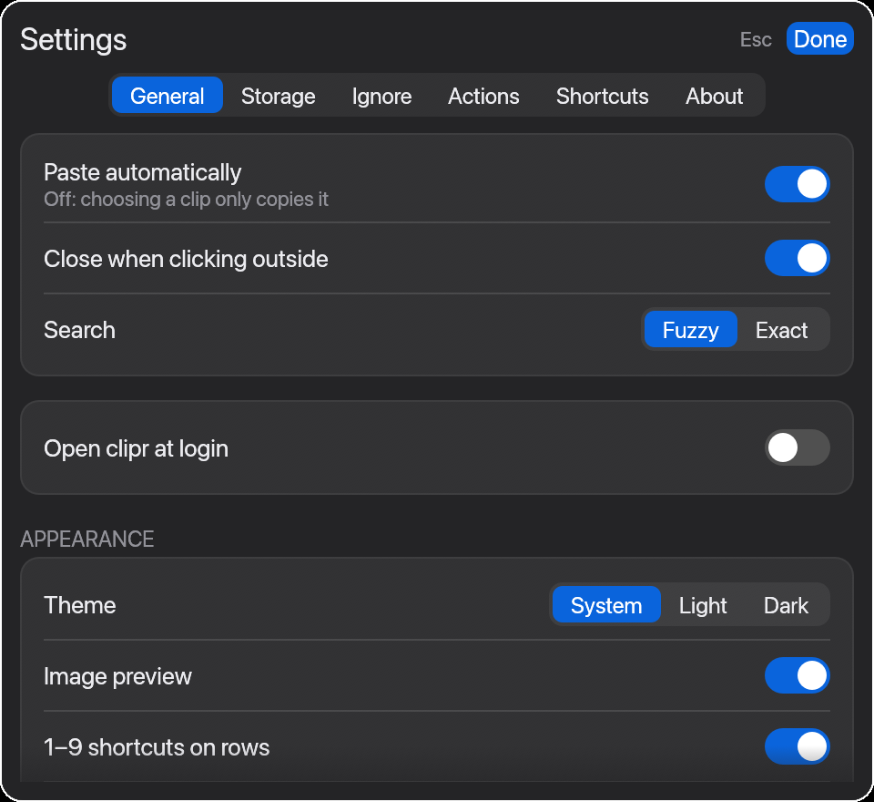

<p align="center">
  
</p>

<h1 align="center">clipr</h1>

<p align="center">
  <b>A fast, keyboard-driven clipboard manager for macOS, Windows and Linux.</b><br>
  Clipboard history with search, saved snippets, images and actions, in a tiny native app written in Rust.
</p>

<p align="center">
  <a href="https://github.com/Mudales/clipr/releases/latest"></a>
  
  
  
  <a href="LICENSE"></a>
</p>

<p align="center">
  
</p>

Press a shortcut, type a few letters, hit Enter: the clip is pasted into the app you were
using. clipr remembers everything you copy, so you never lose a link, command or snippet
again. It's a free, open-source alternative to **Maccy** and **Clipdiary**, and works where
most clipboard managers don't: on Wayland (Hyprland, Omarchy) as well as macOS and Windows.

## Features

- **Clipboard history** of text and images, kept between restarts
- **Instant fuzzy search** as you type, and Hebrew / right-to-left text support
- **Paste into the previous app** with Enter or ⌘/Ctrl + 1–9
- **Type it out** as keystrokes, for fields and remote desktops that block paste
- **Saved tab** for snippets you reuse, and **pinned** clips that stay on top
- **Actions:** run a command on a clip (open link, UPPERCASE, trim, or your own shell
  command) and paste the result
- **Preview pane** beside the list: the whole clip, images large, with size and age
- **Image history** with thumbnails
- **Undo** a delete, even after clearing the whole history
- **Fully keyboard-driven**, and every shortcut can be changed
- **Privacy:** skips passwords from password managers, ignores apps and text patterns
  you choose, and can clear the history after a restart. Everything stays on your computer
- **Keeps the clipboard** after the app you copied from closes (Linux)
- **Light:** one small native binary, no Electron, no account, no telemetry
- **Updates itself** from the Settings page

| Image preview | Actions | Settings |
|---|---|---|
|  |  |  |

## Install (no Rust needed)

**macOS & Linux**

```sh
curl -fsSL https://raw.githubusercontent.com/Mudales/clipr/master/install.sh | sh
```

Uninstall: `curl -fsSL https://raw.githubusercontent.com/Mudales/clipr/master/install.sh | sh -s -- --uninstall`

**Windows** (PowerShell)

```powershell
irm https://raw.githubusercontent.com/Mudales/clipr/master/install.ps1 | iex
```

Uninstall: `& ([scriptblock]::Create((irm https://raw.githubusercontent.com/Mudales/clipr/master/install.ps1))) -Uninstall`

## Keys (in the picker)

Defaults (⌘ on macOS, Ctrl on Windows and Linux). All of them can be changed, see below.

| Key | Action |
|---|---|
| type | search |
| ↑ ↓ PgUp PgDn | move |
| Home / End | first / last clip |
| Enter, ⌘/Ctrl + V | paste into the app you were in |
| ⌘/Ctrl + 1–9 | paste item 1–9 |
| ⌘/Ctrl + C, Shift + Enter | copy only |
| ⌘/Ctrl + Z | type it out as keystrokes (for fields that block paste) |
| ⌘/Ctrl + S | save / unsave |
| ⌘/Ctrl + P | pin / unpin (pinned stay at the top of History) |
| Delete, ⌘/Ctrl + Backspace | delete (with a multi-selection: all selected except pinned & saved) |
| ⌘/Ctrl + A | select all shown clips (again to unselect), then Delete clears the history (asks first; pinned & saved are kept) |
| Shift + ↑ ↓ | extend the selection; copy/paste then joins the selected clips line by line |
| Ctrl + Tab, Ctrl + Shift + Tab | switch History ⇄ Saved |
| ⌘/Ctrl + K | Actions menu (run a command on the clip) |
| ⌘/Ctrl + Shift + Z | undo the last delete (also "Undo" at the bottom, or right-click) |
| ⌘/Ctrl + , or ⚙ | Settings |
| right-click a clip | menu with every action |
| Esc | clear the selection, or close |

On a Mac keyboard the key labelled *delete* is Backspace, which also edits the search
text, so deleting a clip is ⌘⌫ (or fn+⌫).

## Settings

Open with ⚙ (next to the tabs) or ⌘/Ctrl + ,. Changes are saved immediately to
`~/.config/clipr/settings.conf`.

- **General:** paste automatically (off = choosing a clip only copies it), close when
  clicking outside, fuzzy or exact search, open at login (macOS, Windows, Linux)
- **Storage:** history size, save images and how many to keep, clear history now or
  automatically after the computer restarts (always keeps pinned & saved)
- **Appearance:** system / light / dark theme, image preview, 1–9 hints, footer hints
- **Ignore:** apps whose copies are never saved (app name or bundle id on macOS,
  window class on Linux) and regular expressions for text that is never saved
- **Actions:** commands to run on a clip (⌘/Ctrl+K or right-click → Actions), then paste
  or copy the result, or just run them. Built-ins: open link, UPPERCASE, lowercase, trim,
  join lines; or any shell command (the clip on stdin, the result on stdout)
- **Keyboard shortcuts:** edit every shortcut; invalid entries are flagged and not saved
- **Updates:** check GitHub for a newer version and install it in place (also `clipr update`)

The shortcuts live in `~/.config/clipr/keys.conf` (`clipr keys` prints the path) and can
also be edited by hand. The macOS global shortcut (`hotkey`) applies after restarting
clipr; on Linux the global shortcut lives in your Hyprland config.

## Build from source

```sh
cargo build --release   # binary: target/release/clipr
```

## macOS

```sh
./scripts/install-macos.sh   # builds, installs ~/Applications/clipr.app and starts it
```

Press **⌘⇧V** to open the picker. Always start clipr as the app (not the bare binary
from a terminal), otherwise macOS asks the *terminal* for Accessibility permission.

**Keep the permission across rebuilds:** macOS ties it to the app's signature. Create a
self-signed certificate once — Keychain Access → Certificate Assistant → *Create a
Certificate…*, name `clipr-dev`, Identity Type *Self Signed Root*, Certificate Type
*Code Signing* — and `install-macos.sh` will sign with it. Without it, each rebuild
needs the permission re-granted (remove the old `clipr` entry first, or run
`tccutil reset Accessibility dev.clipr`).

- Releases are signed with a stable (self-signed) certificate, so the Accessibility
  permission survives updates; only builds from source are signed ad-hoc.
- The first paste asks for **Accessibility** permission (System Settings → Privacy & Security → Accessibility) — needed to press ⌘V for you.
- macOS may ask once about clipboard access — choose *Always Allow*.
- Clips marked as secret by password managers are skipped.

## Windows

Installed to `%LOCALAPPDATA%\Programs\clipr` and started at login. Press **Win+Shift+V**
(Win+V stays Windows' own clipboard history); change it under Settings → Keyboard
shortcuts. History and settings live in `%APPDATA%\clipr`.

- No permission prompt is needed to paste or type.
- Windows doesn't let apps send keystrokes to programs running as administrator, so
  clipr can't paste into those unless clipr also runs as administrator.
- Copies that password managers mark as secret are skipped.

## Linux (Hyprland / Omarchy)

Use the one-line installer above. It installs `~/.local/bin/clipr` (and `wtype`, which
sends the paste keystroke) and prints the lines to add to your Hyprland config.
`wl-clipboard` is used for instant capture and image history.

**Hyprland 0.56+ / Omarchy (Lua config; `hyprland.conf` is ignored):**

```lua
-- ~/.config/hypr/bindings.lua
o.bind("SUPER + SHIFT + V", "clipr clipboard history", os.getenv("HOME") .. "/.local/bin/clipr toggle")
-- ~/.config/hypr/autostart.lua
o.launch_on_start(os.getenv("HOME") .. "/.local/bin/clipr")
-- ~/.config/hypr/hyprland.lua (at the end)
o.window("^(clipr)$", { float = true, center = true, stay_focused = true, tag = "-default-opacity", opacity = "1.0 1.0" })
```

**Older Hyprland (`hyprland.conf`):**

```
exec-once = ~/.local/bin/clipr
bind = SUPER SHIFT, V, exec, ~/.local/bin/clipr toggle
windowrule = float, class:^(clipr)$
windowrule = center, class:^(clipr)$
windowrule = stayfocused, class:^(clipr)$
```

Then `hyprctl reload`.

When the app you copied from closes, Wayland empties the clipboard; clipr puts the last
clip back (Settings → General → Keep clipboard). Passwords that a password manager
marks as secret, and copies from ignored apps, are never put back.

Terminals (Alacritty, Ghostty, kitty, ...) automatically get
Ctrl+Shift+V instead of Ctrl+V. Debug by running `~/.local/bin/clipr` in a terminal.

## Releasing

Push a tag (`git tag v0.1.1 && git push --tags`) — GitHub Actions builds the macOS
universal app and the Linux binary and attaches them to a release, which `install.sh` downloads.

## License

[MIT](LICENSE): free to use, change and share, including commercially.
